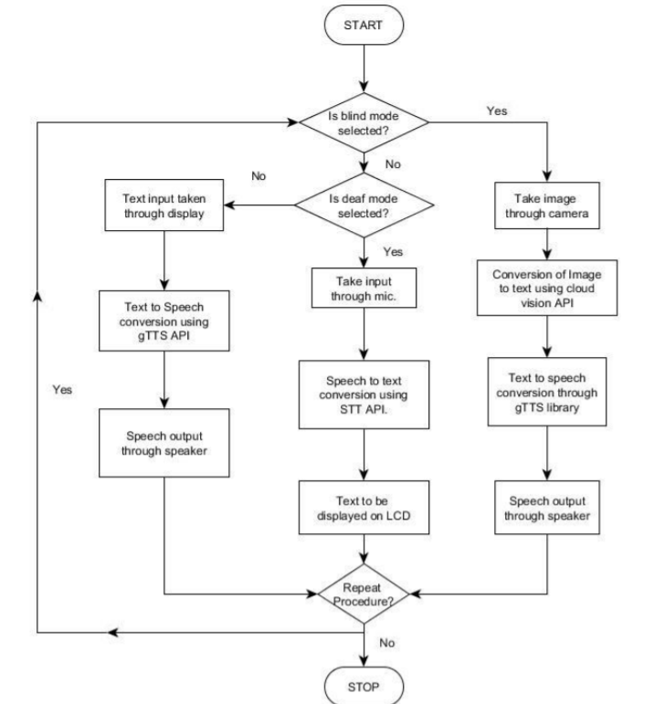

# Assistive-Device
Assistive device for the visually, audibly and verbally challenged using Google APIs

## Modules:

There are three modules in out project:

* The first module is for the visually-challenged. It takes input as the image and converts it to text using the Google Cloud Vision API. The image text is identified and using gTTS the obtained text is converted to speech and given as a output through the speaker.
* The second module is for the audibly challenged and the module takes spoken sentences as the input through the microphone and converts it to text which is displayed through the LCD screen. 
* The last module is for the verbally challenged in which a keyboard is displayed on the LCD through which text input can be taken. The input is converted to speech to give the text a voice and the output is through the speaker.
* The modules are integrated into a small portable device that is controlled by a three way switch that can change the modules according to the user's usability. The device has a single reset button for the reuse of the same module and is simple to use and manipulate.

## Hardware Required: 
* Raspberry pi
* Logitech C310HD Webcam
* Wave share 5 inch display
* USB microphone

## Software Specifications: 
* Google cloud vision API
* Tkinter
* Google Speech to Text API
* Google Text to Speech API
* Bitwise SSH

## Implementation Diagram

**The detailed implementation and information are in the uploaded final report**
